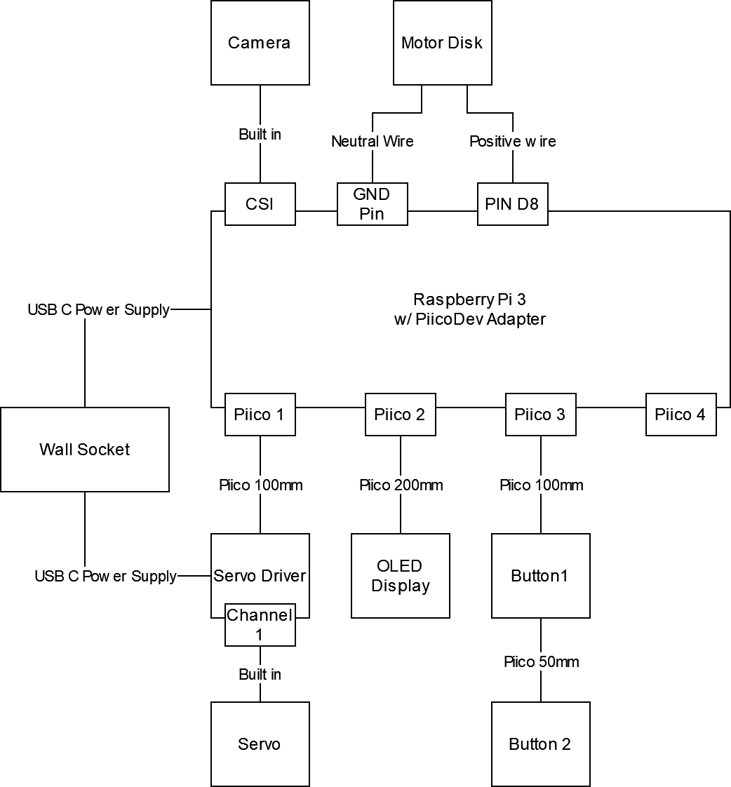

# Sitting Desktop Garden Readme

<center>
{width=10%}\
</center>

The **Sitting Desktop Garden** (SDG) is a cute and customisable artificial potted plant for the home office desk. It monitors the user's posture, providing gentle reminders and gamified incentives to maintain a healthy sitting position as you work. Reminders are delivered through haptic feedback in a vibrating mousepad, which is non-intrusive to the user's workflow, and demonstrating consistently good posture unlocks more beautiful plant growth.

For users setting up a Raspberry Pi for use in the SDG, see [Deployment](#deployment).

---
## Dependencies
The main project dependencies are specified in [pyproject.toml](./pyproject.toml). Notably:

- [mediapipe](https://ai.google.dev/edge/mediapipe/solutions/guide) provides the body landmark detection model.
- [piicodev](https://pypi.org/project/piicodev/) provides modules for interfacing with Raspberry Pi peripherals.
- [face-recognition](https://pypi.org/project/face-recognition/) provides the face recognition model.

## Hardware Set-up
{width=40%}\

The following materials are required to construct this project.

- 1x Raspberry Pi 3B
- 1x PiicoDev Adapter for Raspberry Pi
- 2x PiicoDev Connector 100mm, 1x PiicoDev Connector 200mm, 1x PiicoDev Connector 50mm
- 1x Raspberry Pi Camera Module
- 1x Vibrating Motor Disk
- 2x USB-C Power Supplis
- 1x PiicoDev Servo Driver, 1x PiicoDev OLED Display, 2x PiicoDev Button
- 1x FS90R Servo.

The above wiring diagram shows how to connect these components. The components must be connected before turning on the Pi for the first time.

## Deployment
### Single command all-in-one
To set up the Pi's environment, deploy the code base, and start the program follow the following steps.

1. Flash an SD card with a fresh installation of the 64bit Raspberry Pi OS using the [official imager](https://www.raspberrypi.com/software/). When imaging the SD card you must turn on the SSH connections in the edit OS settings menu.
2. Plug the SD card into the Pi and turn it on. Wait for the green light to stop flashing before going to step 3.
3. Clone this git directory to your computer.
4. From the base directory of the project run,
```
./run.sh [Pi Hostname/IP] [Pi Username]
```
If you do not have `sshpass` installed this may prompt for the Pi's password many times.

5. The above command will take a while.

Sometimes DLib will not compile the first time. If this occurs please run the above command again.

### Pi Environment Set-up
You can set up the Pi's environment by following steps 1,2, and 3 of the above instructions. and then running.
```bash
scripts/bootstrap.sh [Pi Hostname/IP] [Pi Username]
```

### Deploy codebase
You can deploy the codebase by running 
```bash
cd scripts
./deploy.sh ../deploypaths.txt [Pi Hostname/IP] [Pi Username]
```

### Run Program
You can start up the program by running
```bash
cd scripts
./ssh [Pi Username]@[Pi Hostname/IP] 'bash -s' < run_garden.sh
```