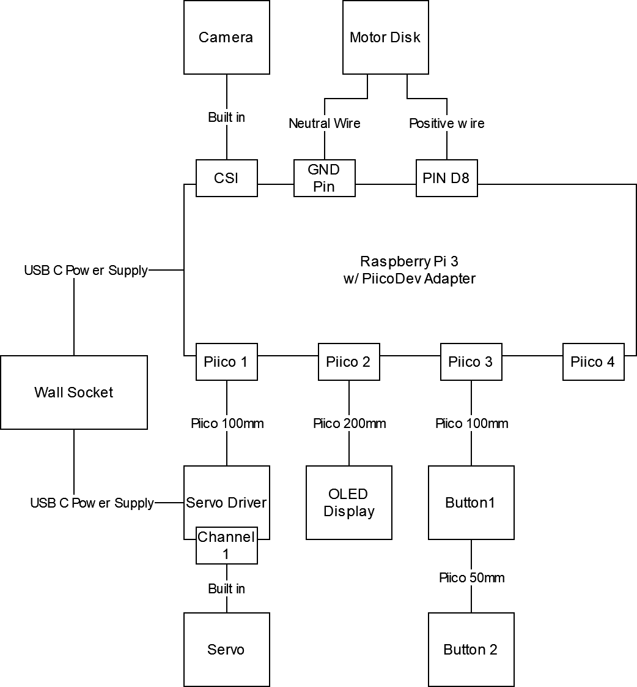

# Sitting Desktop Garden
***2024 Semester 2 DECO3801 Project by Limao Chang, Mitchell Clark, Gabriel Field, Ben Varley, David Ramsay, Iain Jensen***

<center>
</center>

<p align="center" width="100%">

</p>

The **Sitting Desktop Garden** (SDG) is a cute and customisable artificial potted plant for the home office desk. It monitors the user's posture, providing gentle reminders and gamified incentives to maintain a healthy sitting position as you work. Reminders are delivered through haptic feedback in a vibrating mousepad, which is non-intrusive to the user's workflow, and demonstrating consistently good posture unlocks more beautiful plant growth.

The SDG is controlled with a Raspberry Pi, which runs all machine learning models and stores all user data locally. No internet connection is required once the Raspberry Pi is set up.

We use a facial recognition system to facilitate user logins and registrations to allow for multiple users to share one SDG. This can be useful in shared workspaces and offices (hot desking). Once the user is logged in, the camera monitors user posture by tracking their body landmarks and determining their neck and hip angles.

Real-time feedback is delivered via a vibrating mousepad, which reminds the user to sit up straight if they are not sitting correctly. Current-session feedback can be viewed via the SDG's monitor to show the user how their posture has progressed over the current session, as well as via the physical growth of the potted plant.

For developers, see [Project Overview](#project-overview). For users setting up a Raspberry Pi for use in the SDG, see [Deployment](#deployment).

---

**Table of Contents**

- [Sitting Desktop Garden](#sitting-desktop-garden)
  - [Project Overview](#project-overview)
    - [Directory Structure](#directory-structure)
    - [Dependencies](#dependencies)
  - [Hardware Set-up](#hardware-set-up)
  - [Deployment](#deployment)
    - [Single command all-in-one](#single-command-all-in-one)
    - [Pi Environment Set-up](#pi-environment-set-up)
    - [Deploy codebase](#deploy-codebase)
    - [Run Program](#run-program)
  - [Development](#development)
    - [Installation](#installation)
    - [Dependencies](#dependencies-1)
    - [Code Styling](#code-styling)
    - [Documentation](#documentation)


## Project Overview
### Directory Structure
```
.
├── client
│   ├── data: Data handling. Includes user, posture and face id data.
│   ├── drivers: Control flow software. Includes basic control flow and appropriate data structures.
│   └── models: Machine learning models (pose detection and face recognition).
├── demos: Demo Python scripts for showcasing key functionality.
├── docs: Project documentation.
├── notebooks: Demos for module use.
└── scripts: Bash scripts to run on the Pi for bootstrapping and running the SDG.
```

### Dependencies
The main project dependencies are specified in [pyproject.toml](./pyproject.toml). Notably:
- [mediapipe](https://ai.google.dev/edge/mediapipe/solutions/guide) provides the body landmark detection model.
- [piicodev](https://pypi.org/project/piicodev/) provides modules for interfacing with Raspberry Pi peripherals.
- [face-recognition](https://pypi.org/project/face-recognition/) provides the face recognition model.

## Hardware Set-up
<p align="center" width="100%">

</p>
The following materials are required to construct this project.

- 1x Raspberry Pi 3B
- 1x PiicoDev Adapter for Raspberry Pi
- 2x PiicoDev Connector 100mm, 1x PiicoDev Connector 200mm, 1x PiicoDev Connector 50mm
- 1x Raspberry Pi Camera Module
- 1x Vibrating Motor Disk
- 2x USB-C Power Supplis
- 1x PiicoDev Servo Driver, 1x PiicoDev OLED Display, 2x PiicoDev Button
- 1x FS90R Servo.

The above wiring diagram shows how to connect these components. The components must be connected before turning on the Pi for the first time.

## Deployment
### Single command all-in-one
To set up the Pi's environment, deploy the code base, and start the program follow the following steps.
1. Flash an SD card with a fresh installation of the 64bit Raspberry Pi OS using the [official imager](https://www.raspberrypi.com/software/). When imaging the SD card you must turn on the SSH connections in the edit OS settings menu.
2. Plug the SD card into the Pi and turn it on. Wait for the green light to stop flashing before going to step 3.
3. Clone this git directory to your computer.
4. From the base directory of the project run,
`
./run.sh [Pi Hostname/IP] [Pi Username]
`. If you do not have sshpass installed this may prompt for the Pi's password many times.
5. The above command will take a while.
### Pi Environment Set-up
You can set up the Pi's environment by following steps 1,2, and 3 of the above instructions. and then running.
```bash
scripts/bootstrap.sh [Pi Hostname/IP] [Pi Username]
```
### Deploy codebase
You can deploy the codebase by running 
```bash
cd scripts
./deploy.sh ../deploypaths.txt [Pi Hostname/IP] [Pi Username]
```

### Run Program
You can start up the program by running
```bash
cd scripts
./ssh [Pi Username]@[Pi Hostname/IP] 'bash -s' < run_garden.sh
```

## Development

### Installation
**Important**: Make sure you have Python 3.10 or 3.11 installed. Importantly, the code for interfacing with the camera (`client/drivers/camera_overlord.py`) **MUST** be run on Python 3.11.

We use [Poetry](https://python-poetry.org/) for dependency management. The installation instructions can be found [here](https://python-poetry.org/docs/).  Once you have Poetry installed, you can install the project dependencies (and the `sitting-desktop-garden` package) with

```bash
poetry install
```

`poetry install` will use the exact versions found in `poetry.lock` so that the environment can be replicated exactly. This automatically creates a virtual environment for you (see `poetry env info`). To run commands within this virtual environment, you can either use

```bash
poetry run <command>
```

to run a single command within the environment (e.g. `poetry run python script.py`), or

```bash
poetry shell
```

to drop yourself in a nested shell which has the environment activated.

You can check that the `sitting-desktop-garden` package has been installed correctly with this command:

```bash
poetry run pip list | grep sitting-desktop-garden
```

### Dependencies

To add a new dependency to the package, use

```bash
poetry add <package-name>
```

To add a *dev* dependency to the package, use

```bash
poetry add <package-name> --group dev
```

Removing packages is done in the same way but with `remove` instead of `add`.

**Important**: If you make any changes to the dependencies, make sure to commit `poetry.lock`. This will ensure that others can reproduce your exact environment when they next run `poetry install`.

Note that both regular and dev dependencies will be installed with `poetry install`. To exclude the dev dependencies (e.g. when installing on the Raspberry Pi), use

```bash
poetry install --without dev
```

To see a list of installed packages, use `poetry show`, or `poetry show --tree` for a graphical view. You can also see a list of non-dev dependencies with `poetry show --only main` or `poetry show --without dev`.

### Code Styling

We use [black](https://black.readthedocs.io/en/stable/) for automated code formatting. To run Black, run this command from the root of the repo:

```bash
poetry run black client
```

To style individual files, you can use

```bash
poetry run black client/models/pose_detection/classification.py
```

### Documentation

We use [Sphinx](https://www.sphinx-doc.org/) for documentation. To view the documentation locally, run the following command:
```bash
make docs-live
```
This spins up a local server which serves the documentation pages, and also hot-reloads and auto-rebuilds whenever code changes are made.

You can build the documentation (without spinning up a server) with `make docs`, and clean the documentation output with `make docs-clean`.

The single page readme source code is located in `FREADME.md` and can be built with,

```
pandoc FREADME.md --pdf-engine=xelatex -o README.pdf
```

